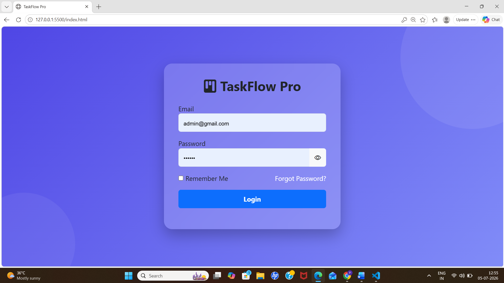
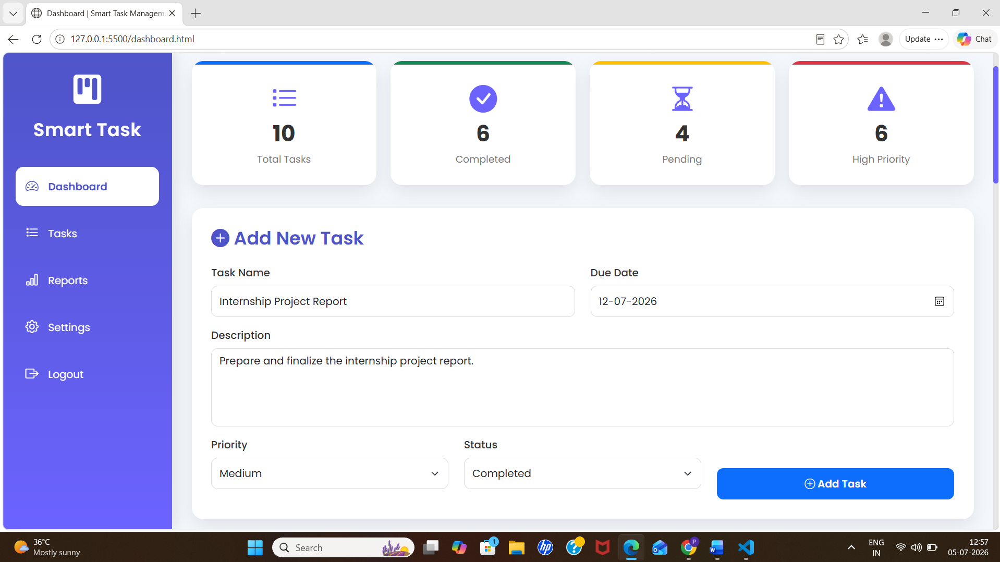
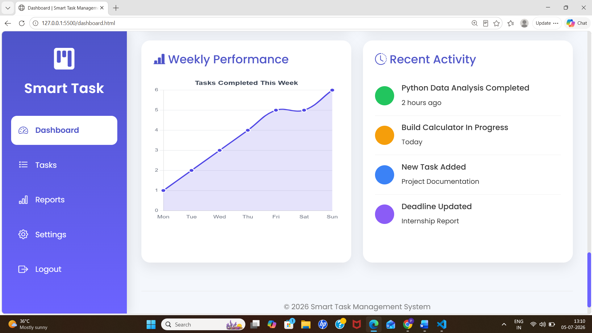

# Smart Task Management System

A responsive web-based Task Management System developed using HTML, CSS, Bootstrap, and JavaScript.

## Features

- User Login Authentication
- Dashboard with Statistics
- Add New Tasks
- Edit Tasks
- Delete Tasks
- Search Tasks
- Priority Management
- Weekly Performance Chart
- Responsive User Interface

## Technologies Used

- HTML5
- CSS3
- Bootstrap 5
- JavaScript
- Chart.js
- SweetAlert2

## Folder Structure

```
Smart-Task-Management-System
│
├── css/
├── images/
├── js/
├── dashboard.html
├── index.html
└── README.md
```


## Screenshots

### Login Page


### Dashboard


### Weekly Chart


Last Updated: 17 July 2026
## Author

**Pandiselvi K**